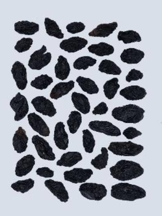
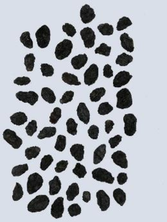

# Raisins.py

This application launches a Streamlit dashboard to explore the difference between two types of raisins grown in Turkiye.

> 
>  
> Besni (left) and Kecimen (right) Raisins

_hosted by Streamlit.io at_ 
https://jrbarhydt-raisinexplorer-raisins-c3z4pe.streamlitapp.com/

---

## Data Source:

Raisin_Dataset.csv from: 
http://archive.ics.uci.edu/ml/datasets/Raisin+Dataset  
original data source and images: 
https://doi.org/10.30855/gmbd.2020.03.03

---

## To Run:

    - streamlit run Raisins.py

---

## Requirements:

    - python 3.9
    - streamlit
    - pandas
    - plotly

---

## Data Preparation:
    
    - All Data was comma delimited
